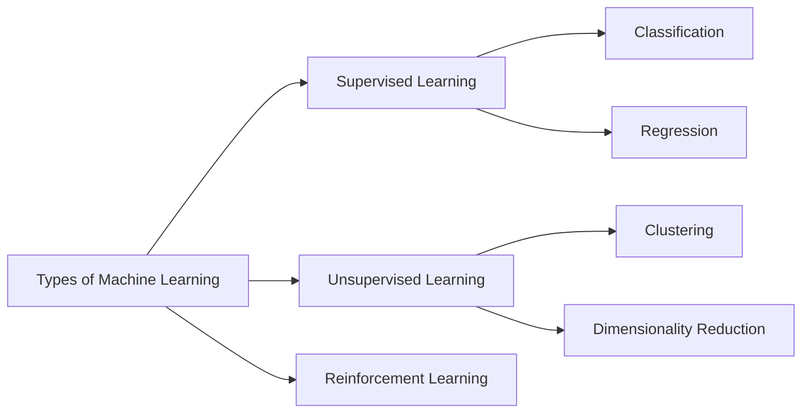

# DataSense
Smart Predictive Analytics & Visualization Tool

DataSense is a beginner-friendly yet powerful Machine Learning analytics web app. It detects whether a dataset is **Supervised** or **Unsupervised**, then guides the user through appropriate models, visualizations, and evaluation metrics.

## ✨ Features
- Upload CSV datasets
- Auto-detect learning type (Supervised vs Unsupervised)
- Supervised Learning
	- Classification or Regression detection
	- Train/Test split control
	- Models: Linear Regression, Logistic Regression, Decision Tree, Random Forest, K-NN
	- Metrics: Accuracy, Confusion Matrix, MAE, MSE, R2
- Unsupervised Learning
	- K-Means clustering
	- Optional PCA (Dimensionality Reduction)
- Visualizations
	- Scatter Plot
	- Correlation Heatmap
	- Outlier Detection (IQR / Z-score)
	- Cluster visualization

## 📌 Machine Learning Concepts (from the screenshot)


## 📁 Sample Datasets
Use the sample datasets in [sample_datasets](sample_datasets):
- supervised_demo.csv
- unsupervised_demo.csv

## ✅ Setup
1. Create a virtual environment (optional)
2. Install dependencies:
	 ```bash
	 pip install -r requirements.txt
	 ```
3. Run the app:
	 ```bash
	 streamlit run app.py
	 ```

## 🧠 Auto-Detection Logic
The app checks for common target column names (like `target`, `label`, `class`, `y`).
If found, Supervised Learning is chosen; otherwise, Unsupervised Learning is used.

## 🚀 Advanced Ideas (Optional Enhancements)
- Hyperparameter tuning (GridSearchCV)
- Feature importance charts
- SHAP explanations
- Model comparison dashboards
- Export predictions and trained models

## 📷 Screenshot Reference
The diagram in the README mirrors the concepts from your Machine Learning types screenshot.
