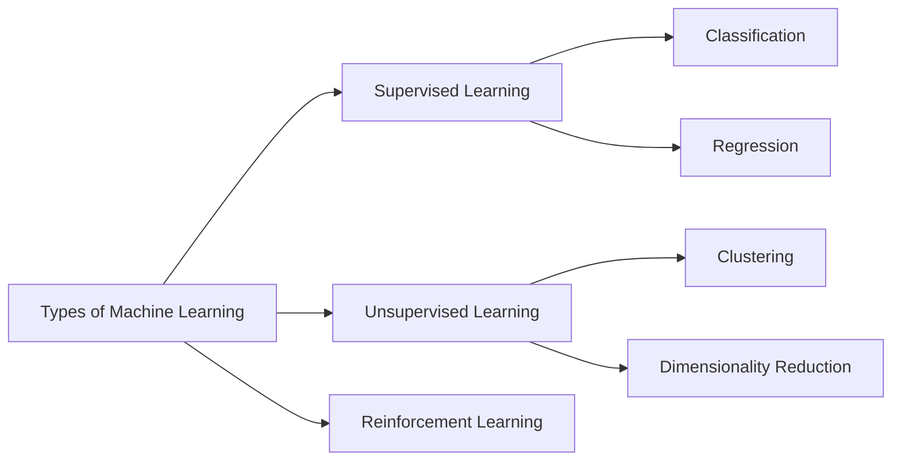

# DataSense
Smart Predictive Analytics and Visualization Tool

DataSense is a beginner-friendly yet practical Machine Learning analytics web app built with Streamlit. It helps users upload CSV data, detect likely ML task type, train models, compare performance, and explore visual insights.

## Features
- Upload CSV datasets
- Smart task detection with target-name and low-cardinality heuristics
- Supervised learning workflow:
	- Classification/Regression detection
	- Class distribution and imbalance warning
	- Train/test split and optional feature scaling
	- Reproducible training via configurable random seed
	- Optional 5-fold cross-validation
	- Baseline benchmark comparison (Dummy models)
	- Models: Linear Regression, Logistic Regression, Decision Tree, Random Forest, K-NN
	- Metrics: Accuracy, Precision, Recall, F1, Confusion Matrix, ROC-AUC (binary), MAE, MSE, R2
	- Quick side-by-side model comparison table
	- Feature importance / coefficient views
	- Regression residual plot
	- Downloadable prediction results (CSV)
- Unsupervised learning workflow:
	- K-Means clustering
	- Optional PCA (with explained variance)
	- Optional elbow analysis for K selection
	- Silhouette score quality indicator
	- Cluster center table
	- Download clustered dataset (CSV)
- Visualizations:
	- Scatter plot
	- Correlation heatmap
	- High-correlation pair finder
	- Outlier detection (IQR / Z-score)
	- Cluster visualization

## Machine Learning Concepts


## Sample Datasets
Use sample data in [sample_datasets](sample_datasets):
- supervised_demo.csv
- unsupervised_demo.csv

## Setup
1. Create a virtual environment (optional)
2. Install dependencies:
	```bash
	pip install -r requirements.txt
	```
3. Run the app:
	```bash
	streamlit run app.py
	```
4. Open the landing page (optional):
	- Open `index.html` in your browser for a project overview.

## Auto-Detection Logic
The app first checks for common target column names such as `target`, `label`, `class`, and `y`.
If none are found, it applies a heuristic based on low-cardinality columns to suggest a likely supervised target.
Otherwise, it defaults to unsupervised analysis.

## Future Enhancements
- Hyperparameter tuning (GridSearchCV)
- Feature importance charts
- SHAP explanations
- Model comparison dashboards
- Export predictions and trained models
